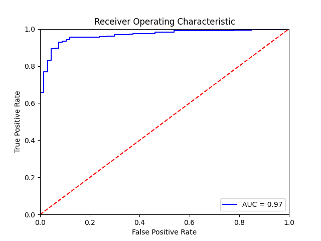

# Ear detection implementation with fine tunning Faster R-CNN

Model can be downloaded from
http://www.mediafire.com/file/t6yj925dgdgkigc/faster-rcnn-ear.pt/file

put it in `./output/` folder.

## Results

Predicted images from test dataset can be seen in ./output/predictions

ROC of the model:



## Install

```
pip install -r requirenments.txt
```

## Train

To train new model run

```
python trainModel.py
```

## Evaluation

```
python evaluateModel.py
```

## Predict

```
python predict.py --image <path to image>
```
